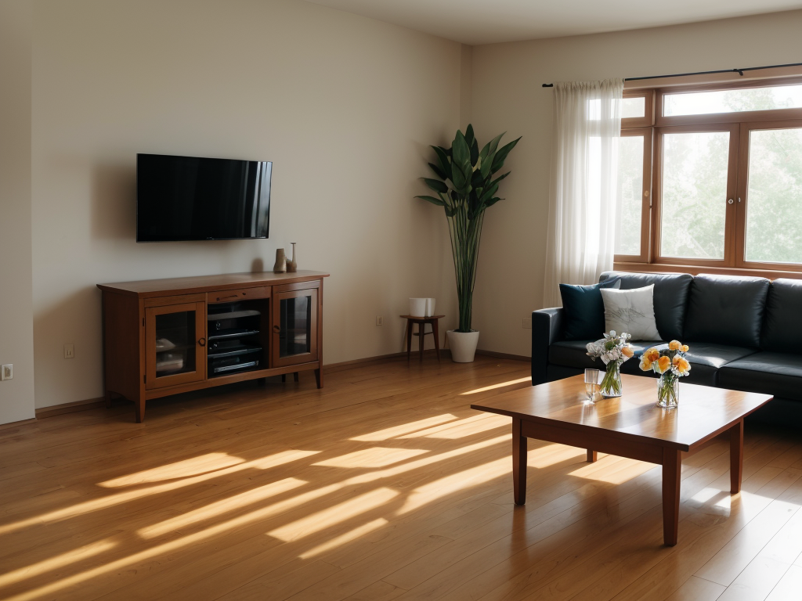

<div align="center">
<h1> Interior-stable-difusion: Revolutionizing Interior Design with Rapid Visualization and Customization </h1>
</div>

<div style="display: flex; justify-content: center; flex-wrap: nowrap; overflow-x: auto;">
  
  
  
</div>

The evolution of AI technologies like [Stable Diffusion](https://arxiv.org/abs/2112.10752) has revolutionized visual design. Now, with "Interior-Stable-Diffusion," this technology is tailored for interior design, enabling rapid generation, style modification, and object replacement in interior spaces. This application empowers designers to visualize and refine spaces with unprecedented speed and precision, transforming ideas into reality in moments.

---

## 🎯 Main Functions

Using Stable Diffusion, this app can generate desirable interior images with three main features:

- **General Generation**: Utilize the [text2img pipeline](https://huggingface.co/docs/diffusers/en/api/pipelines/stable_diffusion/text2img) to create detailed interior images from textual descriptions.
- **Fixing Style**: Leverage the [ControlNet Canny](https://huggingface.co/lllyasviel/sd-controlnet-canny) technique to maintain original structure while applying new styles.
- **Replacing Object**: Use [Controlnet Inpaint Pipeline](https://huggingface.co/docs/diffusers/en/api/pipelines/controlnet#diffusers.StableDiffusionControlNetInpaintPipeline) to replace objects in masked regions seamlessly.

---

## 🖼️ Examples

### General Generation

<div style="display: flex; justify-content: center; flex-wrap: nowrap; overflow-x: auto;">
  
  
</div>
<p align="center">Prompt: A living room with a TV, wooden floor, a sofa, a nice glass table and a flower in the table</p>

<div style="display: flex; justify-content: center; flex-wrap: nowrap; overflow-x: auto;">
  
  
</div>
<p align="center">Prompt: A large modern kitchen with light grey, brown and white, large kitchen cabinets</p>

### Fixing Style

<div style="display: flex; justify-content: center; flex-wrap: nowrap; overflow-x: auto;">
  
  
</div>
<p align="center">Change: A black table</p>

<div style="display: flex; justify-content: center; flex-wrap: nowrap; overflow-x: auto;">
  
  
</div>
<p align="center">Change: A colorful violet chandelier, darker ceiling.</p>

### Replacing Object

<div style="display: flex; justify-content: center; flex-wrap: nowrap; overflow-x: auto;">
  
  
  
</div>
<p align="center">Prompt: a fridge</p>

<div style="display: flex; justify-content: center; flex-wrap: nowrap; overflow-x: auto;">
  
  
  
</div>
<p align="center">Prompt: a luxury liquor cabinet</p>

---

## 🛠 Installation and Usage

### Environment Setup

```bash
python3 -m venv .env
source .env/bin/activate

git clone https://github.com/Diwas37/Ai_proj.git
cd Ai_proj/Interior-stable-difusion
pip install -r requirements.txt
```

### Download Pretrained Models

```bash
mkdir -p checkpoints && \
curl -L "https://civitai.com/api/download/models/128713" -o checkpoints/Interior.safetensors && \
curl -L "https://civitai.com/api/download/models/195419" -o checkpoints/Interior_lora.safetensors
```

### Run the App

```bash
cd App_demo
streamlit run streamlit_app.py
```

---

## 🧠 Project Overview

This project is a Streamlit-based web application that uses advanced AI models to generate and edit interior designs. Built with Stable Diffusion and ControlNet, the app enables rapid concept visualization from natural language.

---

## 👨‍💻 Tech Stack

- Python 3.11
- Streamlit
- Stable Diffusion
- ControlNet
- LoRA
- Torch, OpenCV, PIL

---

## 👥 Team

- **Diwas Parajuli**
- **Ashish Neupane**

Developed as a project for Artificial Intelligence (COMP 472) under **Lecturer Mr. Sanjog Sigdel**, Kathmandu University, 7th Semester, 2025.

---

## 📄 License

For academic and non-commercial use. Model files are downloaded from public repositories. Refer to respective model licenses before production use.

---

## 📬 Contact

For queries or suggestions, raise an issue on GitHub or contact the developers.
